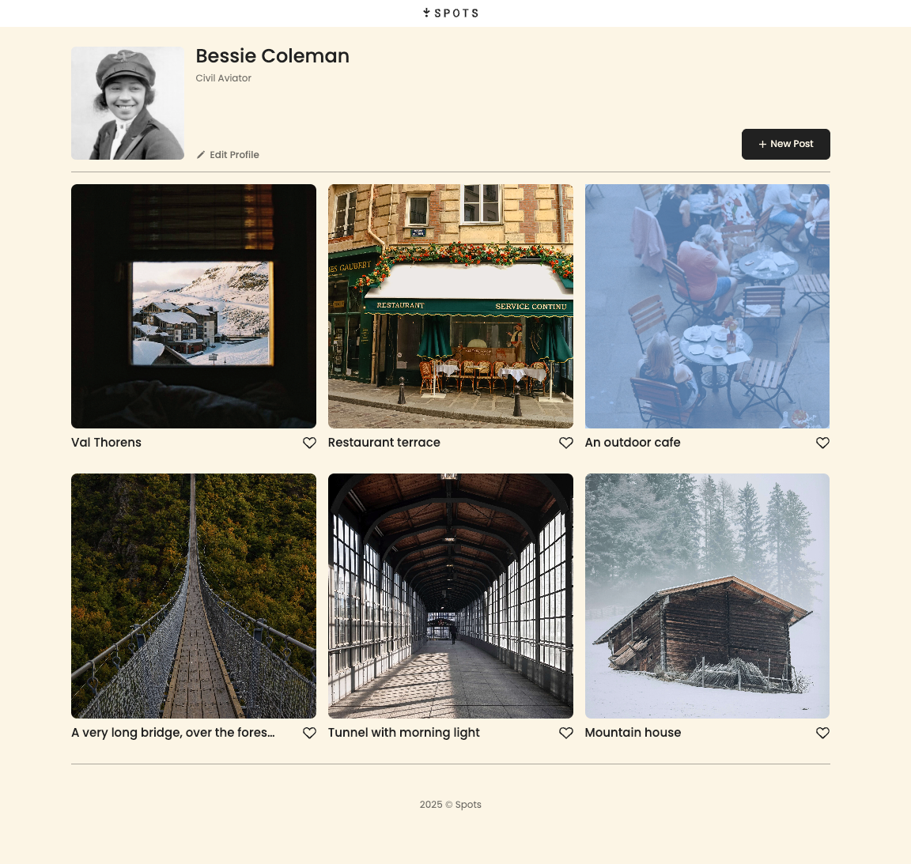

<!-- # Project 3: Spots

### Overview

- Intro
- Figma
- Images

**Intro**

This project is made so all the elements are displayed correctly on popular screen sizes. We recommend investing more time in completing this project, since it's more difficult than previous ones.

**Figma**

- [Link to the project on Figma](https://www.figma.com/file/BBNm2bC3lj8QQMHlnqRsga/Sprint-3-Project-%E2%80%94-Spots?type=design&node-id=2%3A60&mode=design&t=afgNFybdorZO6cQo-1)

**Images**

The way you'll do this at work is by exporting images directly from Figma — we recommend doing that to practice more. Don't forget to optimize them [here](https://tinypng.com/), so your project loads faster.

Good luck and have fun! -->

# Project 3: Spots

A responsive photo-sharing mock-site.
This iteration is static: a profile header, a “New Post” button, and six photo cards with titles and a like icon. The layout adapts cleanly from desktop down to mobile.

## Description

Features (current)
Profile header (avatar, name, description) an “Edit Profile” &
“New Post” button (non-functional in this iteration)
6 photo cards with titles and a like icon
Accessible alt text on images; copyright footer
Fully responsive (320px+)

## Tech Stack

- HTML, CSS
- Flexbox (header/profile for rows) & CSS Grid (card gallery)
- Normalize.css, local Poppins font
- BEM-style CSS organization

## Screenshots

## Deployed project

[- Deployment Link ](https://v-e-x-i-n.github.io/se_project_spots/)

## Demo Video

[\[Watch the demo\]](https://drive.google.com/file/d/1gtKgGpsIPsj9LTwl1nDQf2IzFGBpnfJ6/view?usp=sharing)
